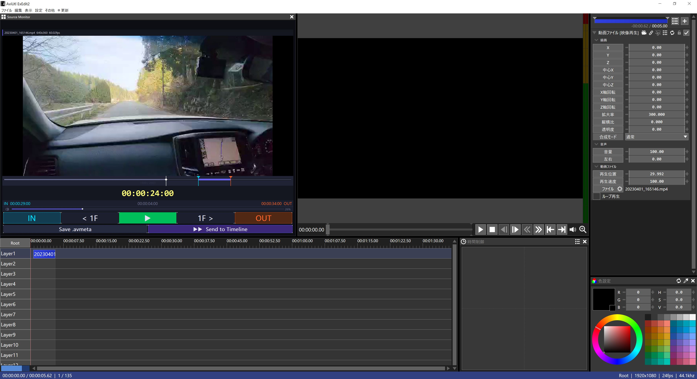

Source Monitor Plugin for AviUtl2
==================================
作：映像学区 https://eizo-gak.com

　

　

概要
----
AviUtl2用のソースモニタープラグインです。
動画・音声ファイルのプレビュー、In/Out点指定、タイムラインへの投げ込みができます。

必要なもの
----------
- AviUtl ExEdit2 (KENくん氏 作)
　https://spring-fragrance.mints.ne.jp/aviutl/

インストール
------------
- SourceMonitor.aux2 を以下に配置する:
  \ProgramData\aviutl2\Plugin\SourceMonitor\SourceMonitor.aux2

- FFmpeg 6.x系（dllファイル群）を「aviutl2.exeと同じ階層」に配置する。
　\Program Files\AviUtl2\〇〇〇〇.dll
　　avformat-62.dll
    avcodec-62.dll
    avutil-60.dll
    swscale-9.dll
    swresample-6.dll

免責事項
----
本プラグインの利用によって発生した一切の損害について、作者は責任を負いません。
個人利用していたプラグインを公開したものであり、一切のサポートを保証いたしません。

利用方法
----
AviUtl2画面左上のメニューバーから「表示」＞「Source Monitor」をクリックで起動。

機能
----
- 動画・音声ファイルのドラッグ&ドロップでプレビューできます。
- In / Out 点を指定し、
  [Send to Timeline]ボタンをクリックするとタイムラインへクリップを投げ込みます。
- 指定したクリップを .avmeta形式のメタファイルとして保存できます

※高画質・高負荷な動画素材では等速再生をサポートしません。音ズレが発生します。
※AviUtl2本体にて非対応のフォーマットは投げ込みができません。
（ソフトウェアが強制終了する場合があります）

License
----
本プラグインは FFmpeg( https://www.ffmpeg.org/ ) LGPL版 を使用します。
同梱のFFmpeg のライセンスは sm_LICENSE_FFmpeg.txt を参照してください。

FFmpeg のソースコードは以下から入手できます：
https://github.com/FFmpeg/FFmpeg

